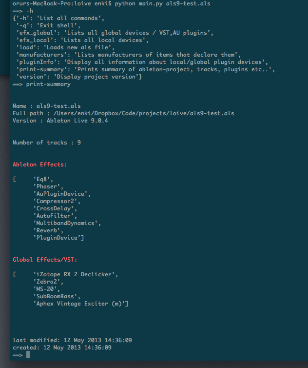

loive
=====

Ableton live project parser

This is all on very early development stage:

Following Michael Garriss great blog post ( http://crooked-hideout.blogspot.com/ ) 

do the following:

	$ cp example.als example.gz
	$ gunzip example.gz
	$ file	example
	example: XML  document text

include XML document in run-folder

I have included this now so all you need to enter is a string to your ableton file

	import loive

	lp = loive.Loive('example.als')

performs copy and gzip, parses the data

NOTE: I think this only works with newer versions of ableton live 8 and above

Dependencies
===========

	etree		--For XML parsing	Link : http://docs.python.org/2/library/xml.etree.elementtree.html
	pprint		--Default			Link : http://docs.python.org/2/library/pprint.html 
	colorama	--color				Link : https://pypi.python.org/pypi/colorama

Shell
======

run:

	python main.py example.als

This will parse information about the live session example.als

	type -h for help

commands

	{'-h'		 : 'List all commands',
	 '-q'		 : 'Exit shell',
	 'efx_local'     : 'Lists all local devices',
	 'efx_global' 	 : 'Lists all global devices / VST,AU plugins' ,
	 'pluginInfo'	 : 'Display all information about local/global plugin devices',
	 'version'	 : 'Display project version',
	 'print-summary' : 'Prints summary of ableton-project, tracks, plugins etc..' ,
	 'load'		 : 'Loads new als file',
	 'manufacturers' : 'Lists manufacturers of items that declare them' } 

Class examples:

	import loive

	lp = loive.Loive('lojibeat.als')
	lp.print_summary()

Prints the status of the file, tracks, vst plugins etc..

You can run full paths to ableton projects, for now you have to indicate this with:

	lp = loive.Loive('/Users/enki/Desktop/Music/nytband/11lagid/11lagid_Project/11lagid.als', 1)

---

	lp.live_version()

returns
		
	[Ableton Live 8.1.3]

Get Plugin info:

	lp.getPluginInfo()

prints

	Ableton Effects: 

	[   'AuPluginDevice',
    	'Compressor2',
    	'Erosion',
    	'PingPongDelay',
    	'OriginalSimpler',
    	'MidiArpeggiator',
    	'Reverb',
    	'DrumGroupDevice']

	Global Effects/VST: 

	['Circle', 'GuitarRig2 FX', 'FM8', 'OhmBoyz']

Tested with Ableton live 8.1.3 and live 9.0.4

screenshot:

Todo:
	
	Add plugin elements as dictionaries
	Automate path/execute properties
